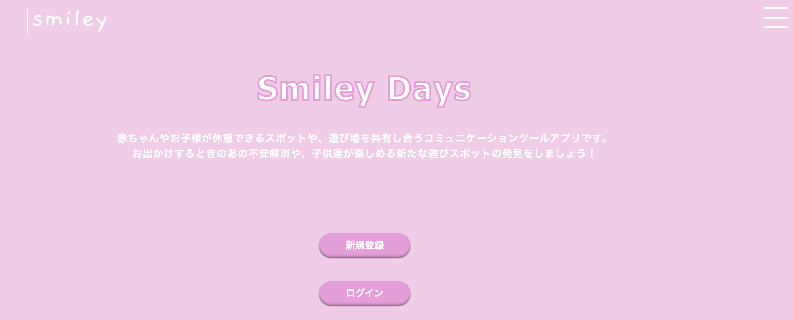
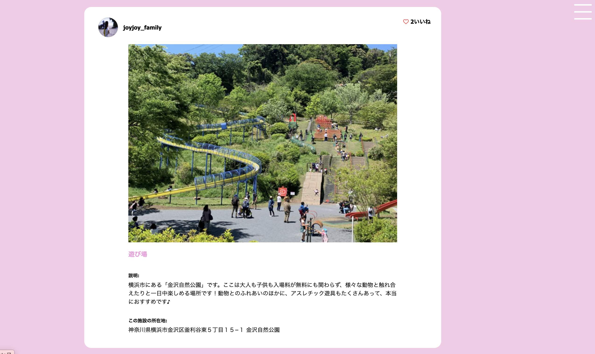
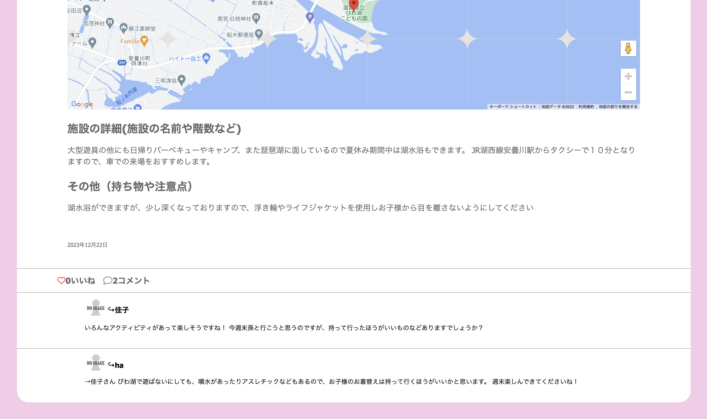

# Smiley-Days

このSmiley-daysというアプリは、子育て奮闘中のパパママやおじいちゃん・おばあちゃんに向けたサイトとなっております。
おでかけがしたいけど、どこでおむつ替えができるのかわからなくて不安。子供とおでかけするのに、毎回同じようなところになってしまって、新しく遊べるところが知りたい！
そういったお子様とのお出かけに関して、遊び場や休憩スポットを共有できるアプリケーションです。

# このサイトのURLはこちら→[ https://smiley-days.net/ ]

__⇩⇩Smiley-days トップページ⇩⇩__

__⇩⇩Smiley-days ポスト一覧画面に表示される投稿です⇩⇩__

__⇩⇩Smiley-days コメントもできます！⇩⇩__

# 目的

冒頭でも記載しましたが、小さなお子様とお出かけするには様々な不安があると思います。
おでかけをする時に、ここにはおむつ替えのシートがあってこの休憩室にはお湯のサーバーがあるなど、事前知識がついた状態であれば安心してお出かけができます。
また子供と出かけるとなると、子供が楽しめるところがいいと考える人が大半だと思います。
普段過ごしている地域の中でも、他の人の投稿を通じて新しい遊びスポットの発見ができたりだとか、あれば良い持ち物などを事前に知っておくことで、不安を感じずお出かけすることが可能になります。
そのような思いから、今回このWebアプリケーションを作成いたしました。

# AWS構成図

# 使用技術
 - Ruby 3.1.2
 - Ruby on Rails 6.1.4
 - MySQL 5.7.43
 - Nginx
 - Puma
 - Docker
 - AWS
   - VPC
   - EC2
   - RDS
   - Route 53
- RSpec
- devise
- Google Maps Platform
- Ajax
- kaminari

# 詳細設計・ER図・テーブル定義書
https://docs.google.com/spreadsheets/d/14mIQhioY1YKtvsVjWl1ZG2QvLKN39cc6dulF_HBMMS4/edit#gid=0

